# 前后端分离的SpringBoot+Vue实战

## 前后端分离概念

前后端分离就是指将一个应用的前端代码和后端代码分开写，前端只需要独立编写客户端代码，后端也只要独立编写服务端代码提供数据接口即可，前端通过Ajax请求来访问后端的数据接口，将Model展示到View中即可。

前后端开发者只需要提前约定好接口文档(URL、参数、数据类型...)，然后分别独立开法即可，前端可以造假数据进行测试，完全不需要依赖于后端，最后完成前后端集成即可，真正实现了前后端应用的解耦合，极大的提升了开发的效率。

单体=》前端应用+后端应用

前端应用：负责数据展示和用户交互；

后端应用：负责提供数据处理接口；

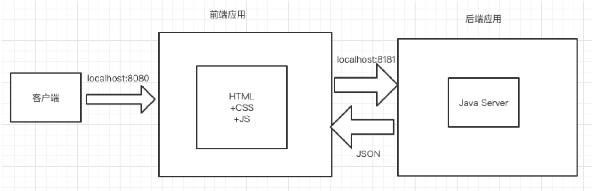

前后端分离我认为就是将一个单体应用拆分成两个独立的应用，前端应用和后端应用以JSON格式进行数据交互。

## 实现技术

Spring Boot + Vue

使用Spring Boot 进行后端开发，使用Vue进行前端开发

## 创建Vue工程

1. 下载node.js安装；

2. 全局安装vue-cli，在cmd里执行：

   ```
   npm install -g vue-cli
   ```

bash命令行中输入：vue ui  可以打开图形页面创建vue工程


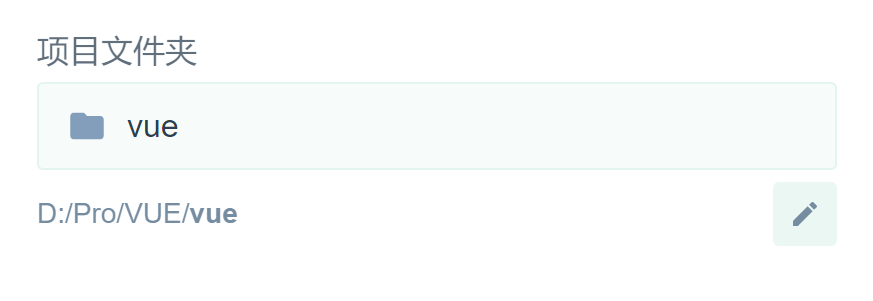


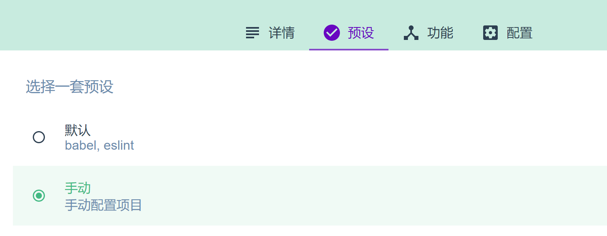

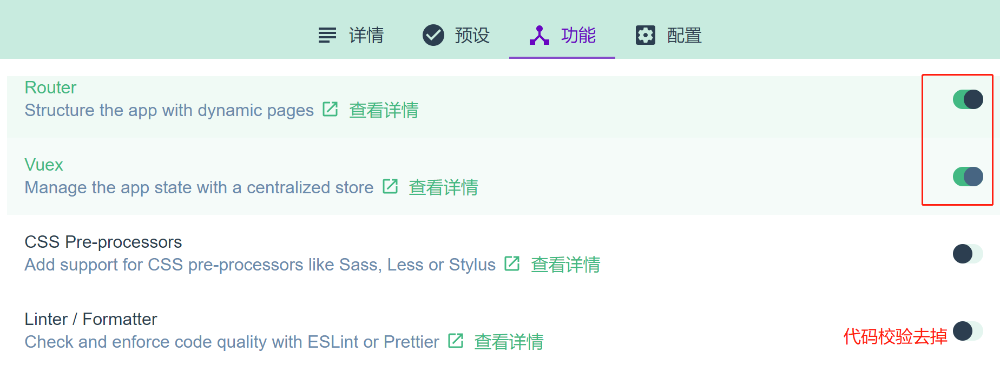

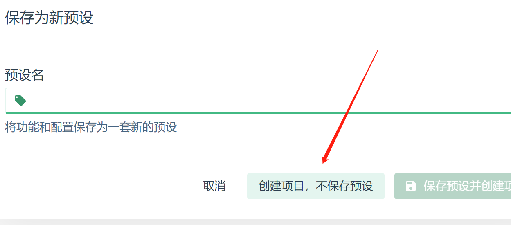

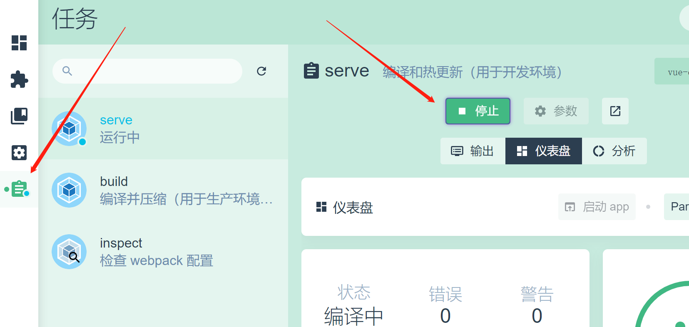

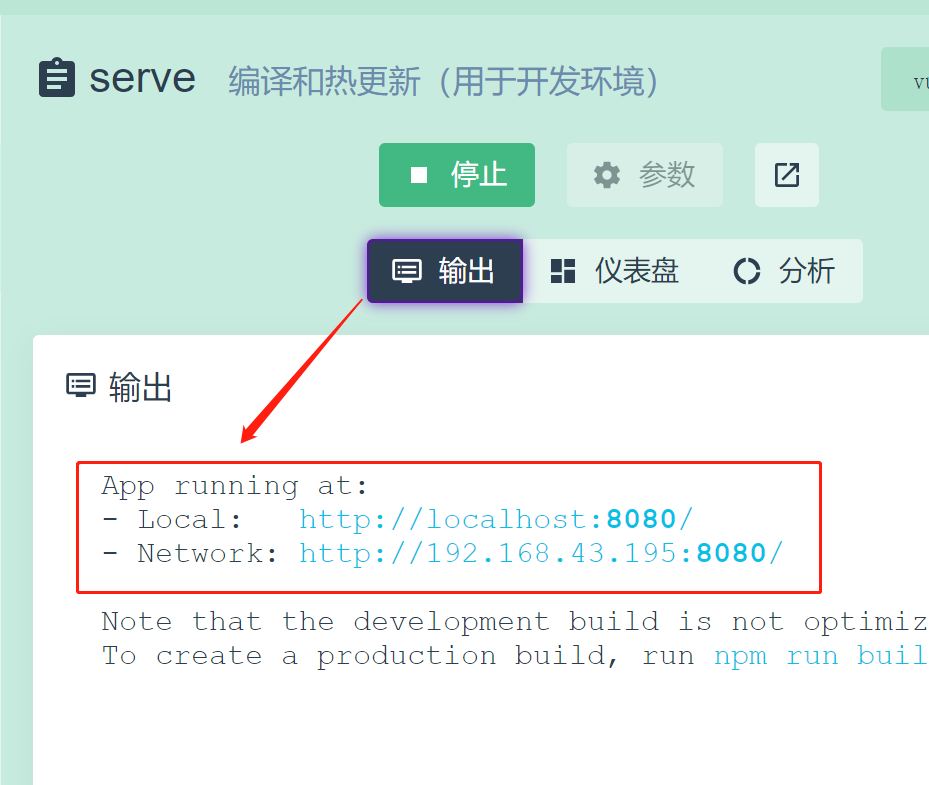


### 创建完毕使用IDEA导入Vue

全部勾选默认，进入项目后安装vue.js插件。

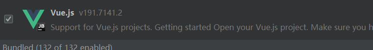

在网页版下载他的插件并导入：


这是一个单页面应用，我们通过IDEA控制台访问他：npm run serve

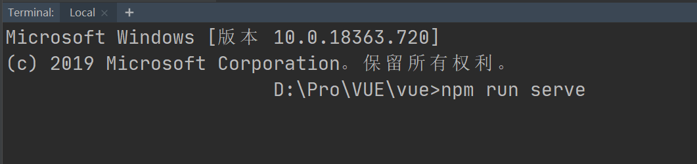

App.vue相当于主页面，而About与Home相当于模板一样。

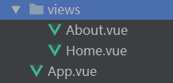

通过router的index.js配置，就可以把App.vue的路径与名字对应起来：

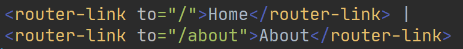

### 创建Spring Boot应用

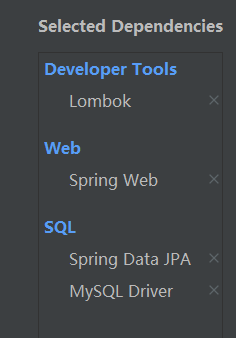

application.yml：

```yml
spring:
  datasource:
    url: jdbc:mysql://localhost:3306/sell?useUnicode=true&characterEncoding=UTF-8&serverTimezone=UTC
    username: root
    password: 123456
    driver-class-name: com.mysql.cj.jdbc.Driver
  jpa:
    show-sql: true
    properties:
      hibernate:
        format_sql: true
server:
  port: 8181
```

回到vue应用：

创Book.vue：


在book页面造假数据测试：

```vue
<template>
    <div>
        <table>
            <tr>
                <td>编号</td>
                <td>图书名称</td>
                <td>作者</td>
            </tr>
            <tr v-for="item in books">
                <td>{{item.id}}</td>
                <td>{{item.name}}</td>
                <td>{{item.author}}</td>
            </tr>
        </table>
        {{msg}}
    </div>
</template>

<script>
    export default {
        name: "Book",
        data(){
            return {
                msg: 'hello Vue',
                books:[
                    {
                        id:1,
                        name:'java',
                        author:'Hex3'
                    },
                    {
                        id:2,
                        name:'java2',
                        author:'Hex2'
                    },
                    {
                        id:3,
                        name:'java3',
                        author:'Hex1'
                    },
                ]
            }
        }
    }
</script>
<style scoped>
</style>
```

发现vue的URL地址带/#，解决方法：index.js中改成：

```js
const router = new VueRouter({
    mode: 'history',
    base: process.env.BASE_URL,
    routes
})
```

#### springboot使用JPA访问数据库

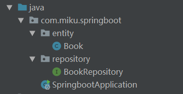

创建实体类Book与表对应：

```java
@Entity
@Data
public class Book {
    @Id
    private Integer id;
    private String name;
    private String author;
}
```

创建BookRepository：

```java
import com.miku.springboot.entity.Book;
import org.springframework.data.jpa.repository.JpaRepository;
//只需要继承Jpa泛型里面有各种数据库操作方法
public interface BookRepository extends JpaRepository<Book,Integer>{
}
```

右键该类名生成测试类：测试findAll方法：

```java
@SpringBootTest
class BookRepositoryTest {

    @Resource
    private BookRepository bookRepository;

    @Test
    void findAll() {
        System.out.println(bookRepository.findAll());
    }
}
```

IDEA的junit5下载太慢，去mvnrepository.com找到1.5.2依赖加到pom里：

```xml
<dependency>
    <groupId>org.junit.platform</groupId>
    <artifactId>junit-platform-launcher</artifactId>
    <version>1.5.2</version>
    <scope>test</scope>
</dependency>
```

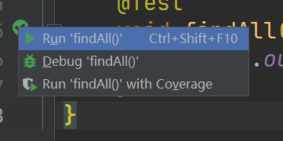

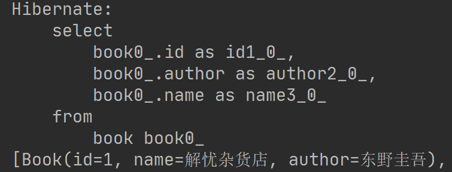

数据不光查询出来，还看到了完整的sql语句，是因为在配置文件里配置了显示并格式化：

```yml
jpa:
  show-sql: true
  properties:
    hibernate:
      format_sql: true
```

创建cotroller：BookHandler类：


```java
@RestController
@RequestMapping("/book")
public class BookHandler {
    @Resource
    private BookRepository bookRepository;

    @RequestMapping("/findAll")
    public List<Book> findAll(){
        return bookRepository.findAll();
    }
}
```

访问：localhost:8181/book/findAll：成功得到了Json数据

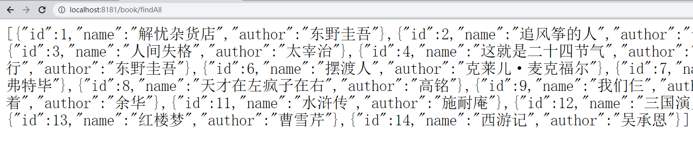

#### 前端vue发送ajax请求8181端口将数据替换

vue需要一个ajax组件axios：控制台输入：vue add axios

安装完毕：

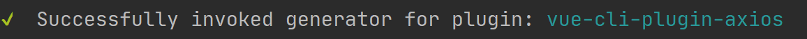

所有的方法都要写在export default 下

创建created方法，能在页面被初始化的时候就做出动作：

```js
created() {
    axios.get('http://localhost:8181/book/findAll').then(function(resp){
        console.log(resp)
    })
}
```

打开页面8080的控制台，发现跨域请求报错：

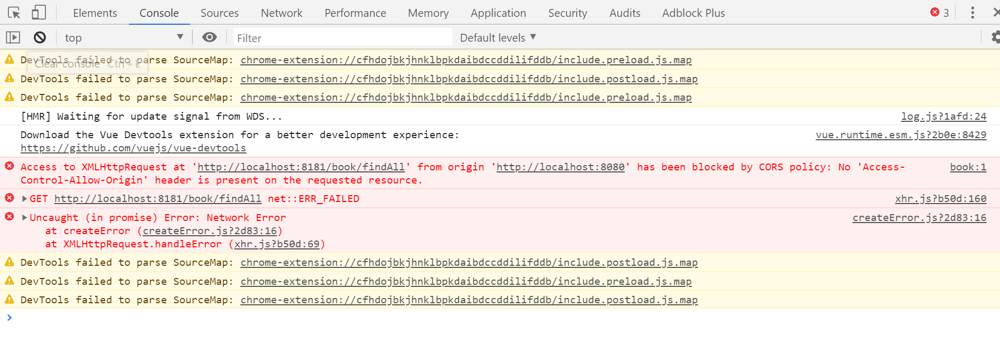

在后端springboot里面解决这个问题：

创建config：crossConfig类：配置get、head等方式都能请求8181服务：

```java
@Configuration
public class CrossConfig implements WebMvcConfigurer {
    @Override
    public void addCorsMappings(CorsRegistry registry) {
        registry.addMapping("/**")
            .allowedOrigins("*")
            .allowedMethods("GET", "HEAD", "POST", "PUT", "DELETE", "OPTIONS")
            .allowCredentials(true)
            .maxAge(3600)
            .allowedHeaders("*");
    }
}
```

~~还是需要多看源码啊，这configuration注解看的我一脸懵逼~~

现在就能顺利拿到8181中的数据了：

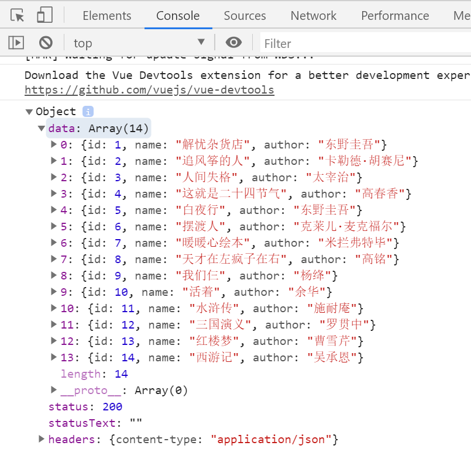

##### 将response里的data赋到books数组里

```js
created() {
    const _this = this
    axios.get('http://localhost:8181/book/findAll').then(function(resp){
        _this.books = resp.data
    })
}
```

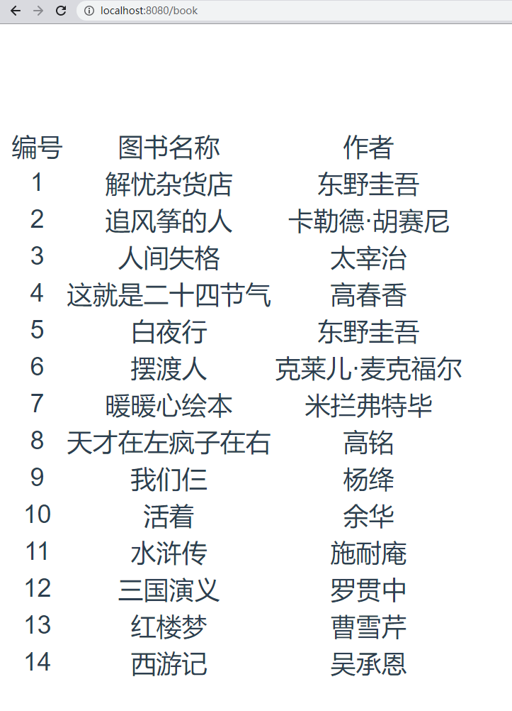

成功显示数据

## Element UI的使用

新建vue工程，并集成Element UI。名称：vuetest

与之前配置相同，然后安装插件：

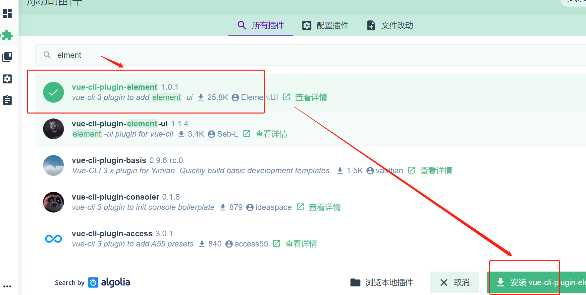

安装完毕后，IDEA导入工程，控制台启动 -> npm run serve：

打开页面，出现按钮表示安装成功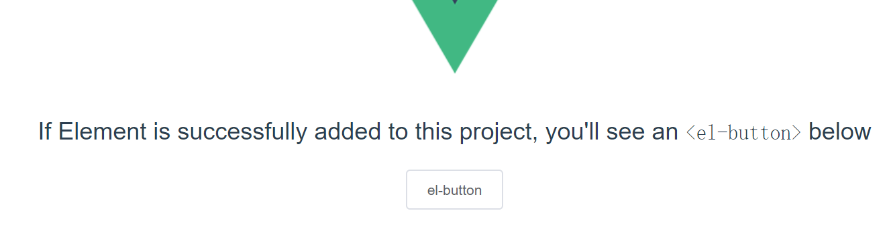

具体使用方式访问官网：element.eleme.cn/#/zh-CN；

我们搭建的是后台管理系统，主要标签：

- el-container：构建整个页面框架；

- el-aside：构建左侧菜单；

- el-menu：左侧菜单内容，常用属性：

  :default-openeds：默认展开的菜单，通过菜单的Index值来关联；

  :default-active：默认选中的菜单，通过菜单的Index值来关联；

- el-submenu：可展开的菜单，常用属性：

  index：菜单的下标，文本类型，不能是数值类型。

- template：对应el-submenu菜单名

- el-menu-item：菜单不可展开的子类；

### Vue router 来动态构建左侧菜单

App.vue：

```vue
<el-container style="height: 500px; border: 1px solid #eee">

    <el-aside width="200px" style="background-color: rgb(238, 241, 246)">

        <!--          $router.options 取的配置文件 .routes 取的是数组 -->
        <el-menu>
            <el-submenu v-for="(item,index) in $router.options.routes" :index="index+''">
                <template slot="title"><i class="el-icon-setting"></i>{{item.name}}</template>
                <el-menu-item v-for="(item2,index2) in item.children":index="index+'-'+index2">{{item2.name}}</el-menu-item>
            </el-submenu>
        </el-menu>

    </el-aside>

    <el-container>
        <el-header style="text-align: right; font-size: 12px">
            <el-dropdown>
                <i class="el-icon-setting" style="margin-right: 15px"></i>
                <el-dropdown-menu slot="dropdown">
                    <el-dropdown-item>查看</el-dropdown-item>
                    <el-dropdown-item>新增</el-dropdown-item>
                    <el-dropdown-item>删除</el-dropdown-item>
                </el-dropdown-menu>
            </el-dropdown>
            <span>王小虎</span>
        </el-header>

        <el-main>
            <router-view></router-view>
        </el-main>

    </el-container>
</el-container>
```

在main里显示新增的4个页面：

```vue
<el-main>
  <router-view></router-view>
</el-main>
```

左侧菜单按钮的设置：

```vue
<el-menu>
    <el-submenu v-for="(item,index) in $router.options.routes" :index="index+''">
        <template slot="title"><i class="el-icon-setting"></i>{{item.name}}</template>
        <el-menu-item v-for="(item2,index2) in item.children":index="index+'-'+index2">{{item2.name}}</el-menu-item>
    </el-submenu>
</el-menu>
```

最主要的是对router下的index.js的routes数组修改：

```js
import PageOne from '../views/PageOne.vue'
import PageTwo from '../views/PageTwo.vue'
import PageThree from '../views/PageThree.vue'
import PageFour from '../views/PageFour.vue'

const routes = [
    {
        path: '/',
        name: '导航1',
        component: App,
        children:[
            {
                path: '/PageOne',
                name: '页面一',
                component: PageOne,
            },
            {
                path: '/PageTwo',
                name: '页面二',
                component: PageTwo,
            },
        ]
    },
    {
        path: 'navigation',
        name:'导航2',
        component: App,
        children: [
            {
                path: '/PageThree',
                name: '页面三',
                component: PageThree,
            },
            {
                path: '/PageFour',
                name: '页面四',
                component: PageFour,
            },
        ]
    },
]
```

views里添加了四个页面：

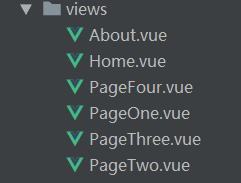

仅添加<h1>：

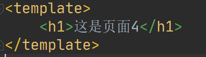

### 设置动态路由导航栏

先明白他的嵌套的逻辑

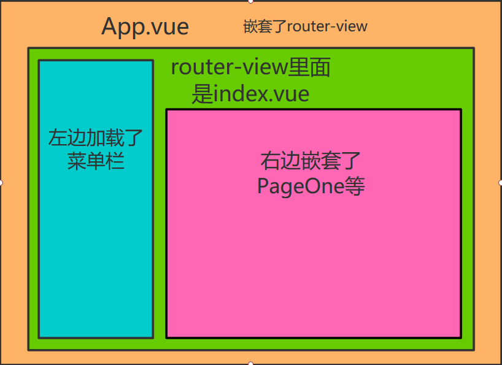

修改后的页面逻辑：

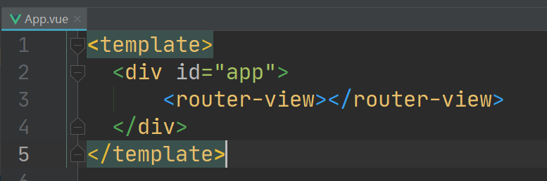

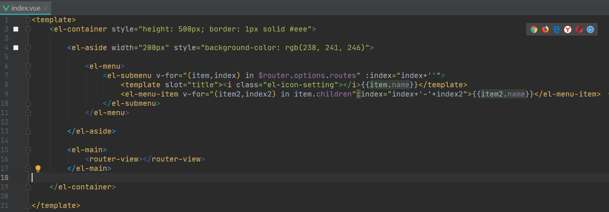

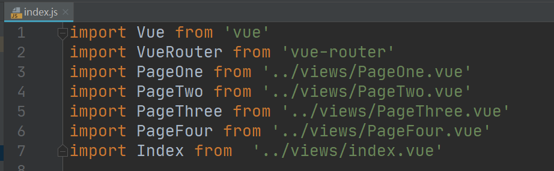

```js
const routes = [
  {
    path: '/',
    name: '导航1',
    component: Index,
    children:[
      {
        path: '/PageOne',
        name: '页面一',
        component: PageOne,
      },
      {
        path: '/PageTwo',
        name: '页面二',
        component: PageTwo,
      },
    ]
  },
  {
    path: 'navigation',
    name:'导航2',
    component: Index,
    children: [
      {
        path: '/PageThree',
        name: '页面三',
        component: PageThree,
      },
      {
        path: '/PageFour',
        name: '页面四',
        component: PageFour,
      },
    ]
  },
]
```

### menu与router的绑定

- el-menu标签添加router属性
- 在页面中添加<router-view>标签。他是一个容器，动态渲染router
- el-menu-item标签的index值就是要跳转的值   (在js中设定了页面的映射)

```vue
<el-menu router >
    <el-submenu v-for="(item,index) in $router.options.routes" :index="index+''">
        <template slot="title"><i class="el-icon-setting"></i>{{item.name}}</template>
        <el-menu-item v-for="(item2,index2) in item.children":index="item2.path">{{item2.name}}</el-menu-item>
    </el-submenu>
</el-menu>
```

```js
const routes = [
  {
    path: '/',
    name: '导航1',
    component: Index,
    //redirect表示打开即显示pageOne
    redirect:'/pageOne',
```

处理打开时菜单栏字体变蓝的选中效果：

通过三元表达式控制 当地址栏的path与当前的页面值相等时，有字体选中active效果：

```vue
:calss="$router.path==item2.path?'is-active':''"
```

再添加默认打开菜单全部选项：

```vue
<el-menu router default-openeds="['0','1']">
```

## 前后端分离开发数据对接

来到ElementUI官网白嫖他的组件：

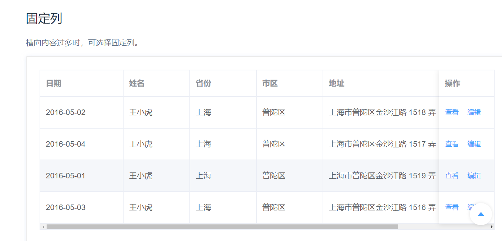

表格pageOne：

```vue
<el-table
          :data="tableData"
          border
          style="width: 100%">
    <el-table-column
                     prop="id"
                     label="编号"
                     width="150">
    </el-table-column>
    <el-table-column
                     prop="name"
                     label="图书名"
                     width="120">
    </el-table-column>
    <el-table-column
                     prop="author"
                     label="作者"
                     width="120">
    </el-table-column>
    <el-table-column
                     label="操作"
                     width="100">
        <template slot-scope="scope">
<el-button @click="handleClick(scope.row)" type="text" size="small">查看</el-button>
<el-button type="text" size="small">编辑</el-button>
        </template>
    </el-table-column>
</el-table>

<script>
    export default {
        methods: {
            handleClick(row) {
                console.log(row);
            }
        },

        data() {
            return {
                tableData: [{
                    id: 1,
                    name: '王小虎',
                    author: '上海',
                }, {
                    id: 2,
                    name: '王小虎',
                    author: '上海',
                }, {
                    id: 3,
                    name: '王小虎',
                    author: '上海',
                }, {
                    id: 4,
                    name: '王小虎',
                    author: '上海',
                }]
            }
        }
    }
</script>
```

将分页按钮与事件绑定：

```vue
<el-pagination
        background
        layout="prev, pager, next"
        :page-size="3"
        :total="30"
        @current-change="page">
</el-pagination>
```

```vue
methods: {
    handleClick(row) {
        console.log(row);
    },
    page(){
        alert(1)
    }
},
```

后台springboot试着将数据分页：

```java
@SpringBootTest
class SpringbootApplicationTests {

    @Resource
    private BookRepository bookRepository;

    @Test
    void contextLoads() {
        PageRequest pageRequest = PageRequest.of(0, 3);
        Page<Book> page = bookRepository.findAll(pageRequest);
        int i = 0;
    }
}
```

JPA自带的page分页对象，得到了数据：

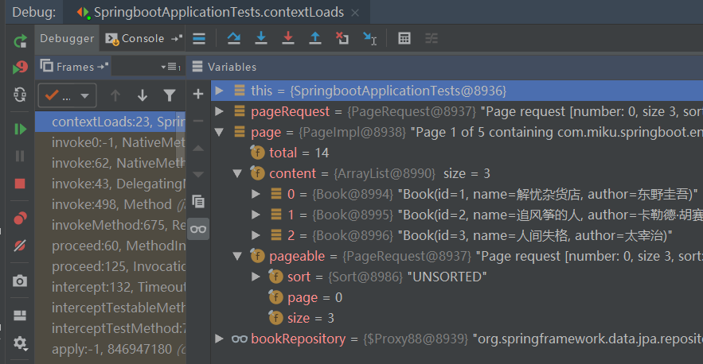

根据前端传来的数据写接口：

```java
@RequestMapping("/findAll/{page}/{size}")
public Page<Book> findAll(@PathVariable("page") Integer page,
                          @PathVariable("size") Integer size){
    PageRequest request = PageRequest.of(page, size);
    return bookRepository.findAll(request);
}
```

回到vuetest：依然需要安装axios：vue add axios，安装完毕刷新页面看console：

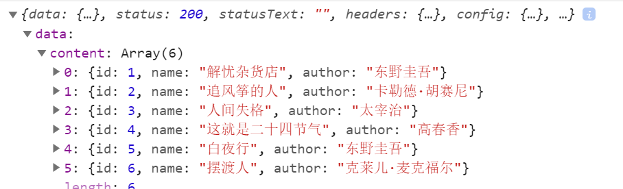

在pageOne.vue里修改page与created方法：

```js
page(currentPage){
    const _this = this
    axios.get('http://localhost:8181/book/findAll/'+(currentPage-1)+'/6').then(function(resp){
        _this.tableData = resp.data.content
        _this.pageSize = resp.data.size
        _this.total = resp.data.totalElements
    })
}
```

## 添加数据


将左侧菜单进行修改：

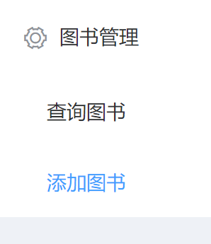

将PageOne改为BookManage，PageTwo改为AddBook：

```js
const routes = [
    {
        path: '/',
        name: '图书管理',
        component: Index,
        redirect:'/BookManage',
        children:[
            {
                path: '/BookManage',
                name: '查询图书',
                component: BookManage,
            },
            {
                path: '/AddBook',
                name: '添加图书',
                component:AddBook,
            },
        ]
    },
```

找到ElementUI的Form表单组件，进行修改，添加到AddBook.vue中：

```vue
<template>
    <el-form :model="ruleForm" :rules="rules" ref="ruleForm" label-width="100px" class="demo-ruleForm">
        <el-form-item label="图书名称" prop="name">
            <el-input v-model="ruleForm.name"></el-input>
        </el-form-item>
        <el-form-item label="作者" prop="author">
            <el-input v-model="ruleForm.author"></el-input>
        </el-form-item>

        <el-form-item>
            <el-button type="primary" @click="submitForm('ruleForm')">提交</el-button>
            <el-button @click="resetForm('ruleForm')">重置</el-button>
        </el-form-item>
    </el-form>
</template>


<script>
    export default {
        data() {
            return {
                ruleForm: {
                    name: '',
                    author: '',
                },
                rules: {
                    name: [
                        { required: true, message: '图书名称不能为空！', trigger: 'blur' },
                    ],
                    author: [
                        { required: true, message: '作者名称不能为空！', trigger: 'blur' },
                    ]
                }
            };
        },
        methods: {
            submitForm(formName) {
                const _this = this
                this.$refs[formName].validate((valid) => {
                    if (valid) {
                        axios.post('http://localhost:8181/book/save',this.ruleForm).then(function (resp) {
                            console.log(resp)
                        })
                    } else {
                        console.log('校验不通过!!');
                        return false;
                    }
                });
            },
            resetForm(formName) {
                this.$refs[formName].resetFields();
            }
        }
    }
</script>
```

springboot后端中测试save方法：测试失败：原因：未设置主键自增

book类追加注解：

```java
public class Book {
    @Id            //设置自增属性：
    @GeneratedValue(strategy = GenerationType.IDENTITY)
    private Integer id;
    private String name;
    private String author;
}
```

```java
@Test         //测试成功
void save(){
    Book book = new Book();
    book.setName("Springboot");
    book.setAuthor("张三");
    Book book1 = bookRepository.save(book);
    System.out.println(book1);
}
```

Controller编写save请求：

```java
@PostMapping("/save")//前端用json格式传来数据加上了@RequestBody才能转成java对象
public String save(@RequestBody Book book) {
    Book result = bookRepository.save(book);
    if (result != null) {
        return "success";
    } else {
        return "error";
    }
}
```

axios的方法中，如添加成功则向控制台发送"success"：添加数据成功：

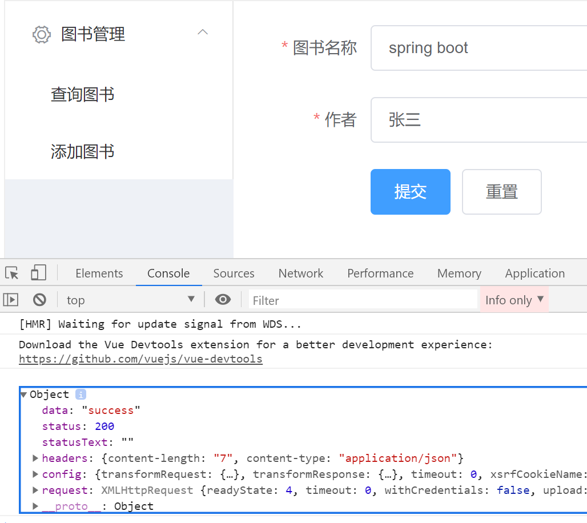

数据库中也出现了张三：

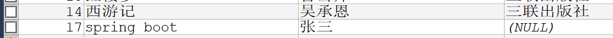

接下来完善处理逻辑：

在提交后跳转回查询图书界面：

```js
submitForm(formName) {
    const _this = this
    this.$refs[formName].validate((valid) => {
        if (valid) {
            axios.post('http://localhost:8181/book/save',this.ruleForm).then(function (resp) {
                if (resp.data == "success"){
                    //_this.$message('添加成功！');
                    //alert('添加成功')
                    _this.$alert('《'+_this.ruleForm.name+'》添加成功！', 'Okay', {
                        confirmButtonText: '确定',
                        callback: action => {
                            _this.$router.push('/BookManage');
                        }
                    });
                }
            })
        } else {
            console.log('校验未通过!');
            return false;
        }
    });
},
```

并且调整输入框宽度：

```
<el-form style="width: 60%"
```

效果：

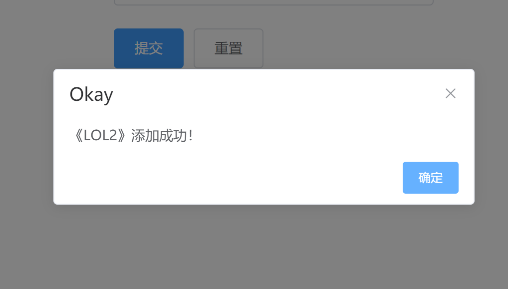

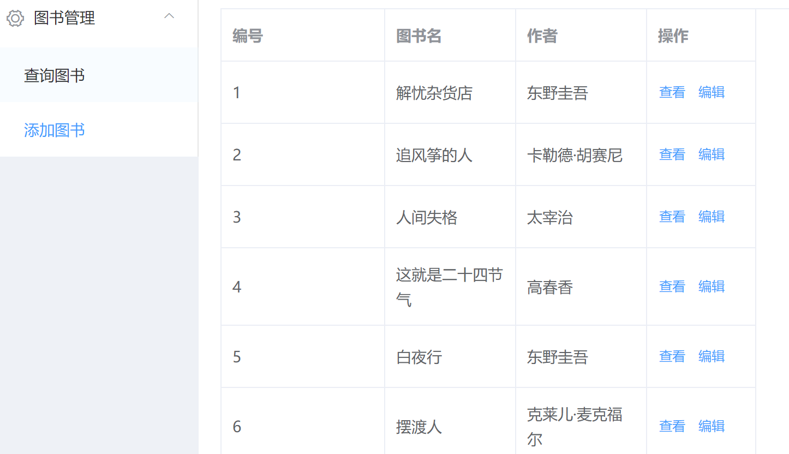

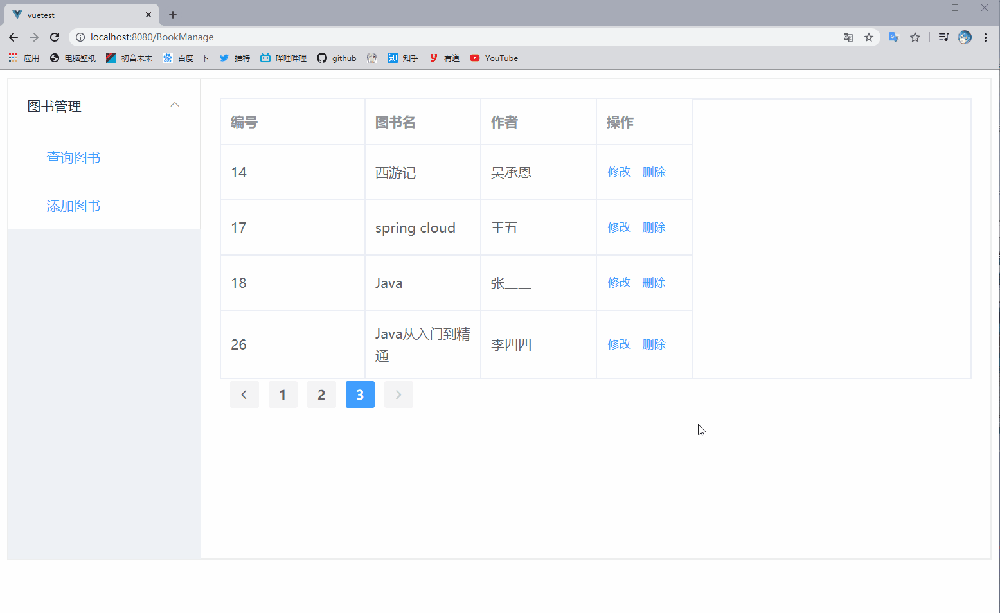


## 修改删除数据

套用添加的模板，在BookUpdate.vue中，修改submitForm方法，完成对后端update的调用：

```js
submitForm(formName) {
    const _this = this
    this.$refs[formName].validate((valid) => {
        if (valid) {
            axios.put('http://localhost:8181/book/update',this.ruleForm).then(function (resp) {
                if (resp.data == "success"){
                    _this.$alert('《'+_this.ruleForm.name+'》修改成功！', 'Okay', {
                        confirmButtonText: '确定',
                        callback: action => {
                            _this.$router.push('/BookManage');
                        }
                    });
                }
            })
        } else {
            console.log('校验未通过!');
            return false;
        }
    });
},
```

BookManage页面的修改与删除按钮，分别绑定到该页的deleteBook方法和edit方法(定向到update页面)

```vue
<template slot-scope="scope">
<el-button @click="edit(scope.row)" type="text" size="small">修改</el-button>
<el-button @click="deleteBook(scope.row)" type="text" size="small">删除</el-button>
</template>
```

```js
deleteBook(row){
    const _this = this
    axios.delete('http://localhost:8181/book/deleteById/'+row.id).then(function(resp){
        _this.$alert('《'+row.name+'》删除成功！', '消息', {
            confirmButtonText: '确定',
            callback: action => {
                window.location.reload()
            }
        })
    })
},
    edit(row) {
        this.$router.push({
            path: '/update',
            query: {id: row.id}
        })
    },
```

这样就完成了修改与删除的操作。

示例：

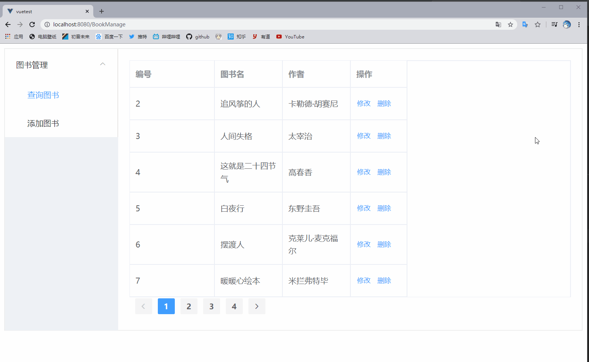